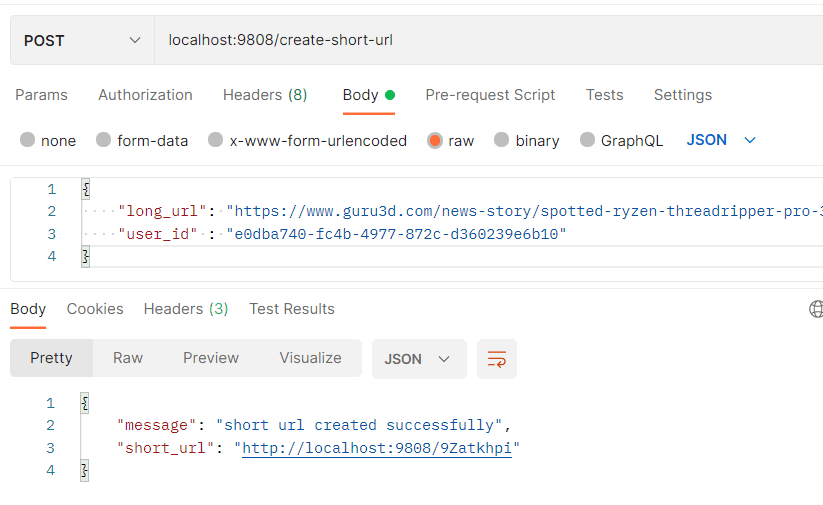

## go-shortener

A super fast URL shortener and redirect tool written in Go
        
                                                                                   _
                                                                                  /_\
                                                                    _            // \\
                                                                   /_\          //   \\
                                                     _            // \\        //   .-.\
                                                    /_\          //   \\      ///--//-')\
                                      _            // \\        //   .-.\    // \-//--' \\
                                     /_\          //   \\      ///--//-')\  ((   ((      ))
                       _            // \\        //   .-.\    // \-//--' \\  \\  No U   //
                      /_\          //   \\      ///--//-')\  ((   ((      ))  \\ Turn  //
                     // \\        //   .-.\    // \-//--' \\  \\ No Left //    \\     //
                    //   \\      ///--//-')\  ((   ((      ))  \\ Turn  //      \\   //
                   //   .-.\    // \-//--' \\  \\ No Right//    \\     //        \\_//| -'
                  ///--//-')\  ((   ((      ))  \\ Turn  //      \\   //    ..--  \_/ |
                 // \-//--' \\  \\  Dead   //    \\     //        \\_//| -'        || |
                ((   ((      ))  \\ End   //      \\   //    ..--  \_/ |           || |
                 \\ Bridge  //    \\     //        \\_//| -'        || |           || |
                  \\ Out   //      \\   //    ..--  \_/ |           || |           || |
                   \\     //        \\_//| -'        || |           || |          )|| | _.-
                    \\   //    ..--  \_/ |           || |           || |     ..--(MJP.-'
                     \\_//| -'        || |           || |          )|| | _.-
                ..--  \_/ |           || |           || |     ..--(MJP.-'
                       || |           || |          )|| | _.-
                       || |           || |     ..--(MJP.-'
                       || |          )|| | _.-
                       || |     ..--(MJP.-'
                      )|| | _.-
                     (MJP.-'

This repository is related to the url shortener tutorial series that I published at eddywm.com.

https://www.eddywm.com/lets-build-a-url-shortener-in-go/

原作者github: https://github.com/eddywm/go-shortener-wm

## 学习收获

这是一个非常简单的Go语言练手项目，非常适合新手简单入门使用，外加作者四篇详尽的教程（连请求接口的curl都写出来了），学习流程非常的畅快。

跟着手敲代码，以及每个模块写完即测试，是非常有成就感的。

学习收获：
1. 添加一个模块后就先测试模块是否能运行
2. go语言的单元测试
3. 了解到了base58和base64
4. 简单使用了gin框架
5. 使用了redis，了解了redis和DB的适用场景

## 一个短链服务应有的

短链接的声明周期？一直有效还是一段时间有效
一直有效：需要适用DB，然后热点数据适用Redis存储

## 生成的短链接不会重复吗？
